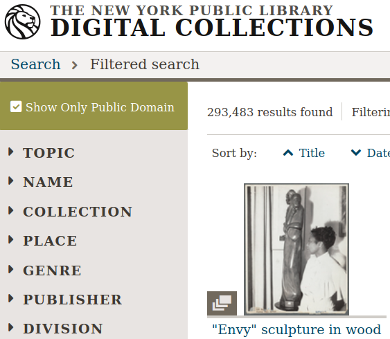

## Outline of this page

- [Micro Quickstart Guide – to copy to Peeragogy.org ✓](http://peeragogy.github.io/action.html#micro-quickstart-guide--to-copy-to-peeragogyorg-)
- [New content: Very High-Level Outline of v4 (the outline itself is still WIP)](http://peeragogy.github.io/action.html#new-content-very-high-level-outline-of-v4-the-outline-itself-is-still-wip)
- [Technology Stack](http://peeragogy.github.io/action.html#technology-stack)
- [Old Introduction](http://peeragogy.github.io/action.html#old-introduction)
- [*Paragogical* Action Review](http://peeragogy.github.io/action.html#paragogical-action-review)
- [Editorial Roles](http://peeragogy.github.io/action.html#editorial-roles)
- [License to sign](http://peeragogy.github.io/action.html#license-to-sign)
- [Rheingoldian Real Time Meeting Roles](http://peeragogy.github.io/action.html#rheingoldian-real-time-meeting-roles)
- [New content: Peeragogical Innovations (9 week pilot)](http://peeragogy.github.io/action.html#new-content-peeragogical-innovations-9-week-pilot)
- [Old content: Welcome to the Peeragogy Accelerator](http://peeragogy.github.io/action.html#old-content-welcome-to-the-peeragogy-accelerator)

## Micro Quickstart Guide -- to copy to Peeragogy.org ✓

- Our ongoing public discussions are on Google Groups at https://groups.google.com/forum/#!forum/peeragogy. Sign up there to get email and post to the wider contributor community. Remember to ask questions!
- The easiest way to get an orientation to our editing work is to join a live discussions on Mondays at 8PM UTC on Jitsi, at the following URL: https://meet.jit.si/peeragogy.  Installation instructions for Jitsi are here: https://jitsi.org/downloads/
- To comment on the Peeragogy Handbook please make an account at  https://hypothes.is/ and use the mini-toolbar on the right-hand side of each page on peeragogy.org.
- If you browse to https://github.com/Peeragogy you will see our Github "organization". The master copy of the Handbook content is at https://github.com/Peeragogy/Peeragogy.github.io. Github has a learning curve, ask for help.

Please have a look at this [longer quickstart guide](https://github.com/Peeragogy/peeragogy-handbook/wiki/Quickstart-guide) for more information about our tools and workflow. 

## New content: Very High-Level Outline of v4 (the outline itself is still WIP)

Also there's a lot of similarity to the main steps in the Paragogical Action Review:

Meso-handbook: Write a pattern for each of these major sections, 5 pages long in total!

Each of the following bullet points should introduce something fairly practical.

1. *Convene*. Review the intention: what do we expect to learn or make together? **Problem**
    *  _Mini-introduction to Peeragogy._
    * *What problem does peeragogy solve? Some history, where did the project come from?*
    *  - maybe putting a map in, to give some context -- like a concept map (ask Howard, find others) 
    * Our intention is to write a "How To Handbook" (how does this help address the problem).
    * How we have put things together here and how we are using the content...
    * Initial content could be based on [Peeragogy](http://peeragogy.github.io/pattern-peeragogy.html) pattern
    * Or on the [Starter Pack](https://docs.google.com/document/d/1w2JZhpkrYYKknpJSSJgz23PPYxI31Cu1eWvw8I9ZraM/edit).
    * Could also incorporate a summary of the "Convene" section.
2. *Organize*. Establish what is happening: what and how are we learning?
    * Incorporate a summary of the "Organize" section
    * [Newcomer](https://hackmd.io/LvcaTX1pTESFTtAMXK8lIg)
    * [Heartbeat](https://hackmd.io/Z-ME-AU2R-203F31uig12A)
3. *Cooperate*. What are some different perspectives on what’s happening?
    * _Incorporate a summary of the "Cooperate" section_
    * [Carrying Capacity](https://hackmd.io/1n-ksWSyQvOw-x6vomBohg) - _what is a different term for this_ Ideal Size?
    * [Reduce, Reuse, Recyle](https://hackmd.io/hEZiRQPkS02BZzwtWJcsKQ) 
4. *Assess*. What did we learn or change?
    * Incorporate a summary of the "Assess" section
    * [Landscape](https://hackmd.io/tnyTuPcaR_GtHZNnYcZyxA)
    * [Scrapbook](https://hackmd.io/Hz9Q3NU8Rgittp9b6oezHw) - where are we going to put our random thoughts! This can be more historical?
5. *Share*. What else should we change going forward? **What's Next**
    * Come up with a "Share" strategy and summarize it here. 
    * [Wrapper](https://hackmd.io/q5K5GstZTsqXTHrCRyYQJA)
    * [Specific Project](https://hackmd.io/xV24x23vQ2G1ScRHXBdMFA)
6. Index of Keywords from across the book
    * Keywords, glossary, similar terms and fields. Automatically generate this once we know what the keywords are.

* (was: *Amanda's image, not terribly relevant but I do think we need some visuals - Charlotte ( how to put this on a separate line?)*)
* Joe: I've replaced that one because I wasn't sure of the licensing status. Remember to use public domain images! Various examples can be found on the [NYPL's website](https://digitalcollections.nypl.org/search/index?filters%5Brights%5D=pd&keywords=) (and, of course, elsewhere).

**Pattern template**

- _Motivation_ for using this pattern.
- _Context_ of application.
- _Forces_ that operate within the context of application, each with a mnemonic glyph.
- _Problem_ the pattern addresses.
- _Solution_ to the problem.
- _Rationale_ for this solution.
- _Resolution_ of the forces, named in bold.
- _Example 1_ How the pattern manifests in current Wikimedia projects.
- _Example 2_ How the pattern could inform the design of a future university.
- _What’s Next_ in the Peeragogy Project: How the pattern relates to our collective intention in the Peeragogy project

* *Many details to be added!*
    * See [v4 draft outline](https://docs.google.com/document/d/1v2TxWlYKqXuD2USl1Sb1OzCknZzTHjli1QCn7RrAQek/edit) on Google Docs for a more detailed draft outline. This version will become more concrete as we work.
    * See [Tufts Course](https://docs.google.com/spreadsheets/d/1pUlzk5uRYHdQmcM1pmllNKhvr21NH-ZXeZf2QJOyobw/edit#gid=0) spreadsheet for one possible schedule of readings.
* *Quickstart Guide*
  * https://github.com/Peeragogy/peeragogy-handbook/wiki/Quickstart-guide
  * Live editable here: https://hackmd.io/syvktfQSTHmCcdYzwKWlEg
* *Introductory Material*
    * Foreword, Preface, Introduction, Workbook 
* *Pattern Catalogue*

## Technology Stack

- We store the master copy of the Handbook in Markdown on Github, in [**this repository**](https://github.com/Peeragogy/Peeragogy.github.io).
- Github publishes to HTML on http://peeragogy.github.io/ (peeragogy.org) redirects to that.
- We are trialing live editing via Floobits, see [**this page**](https://floobits.com/Peeragogy/Handbook/file/action.md:1?new_workspace=1).
- We have also been experimenting with similar features on HackMD, see [**this page**](https://hackmd.io/zEY9rv5QR3O9JFl4jVCYFw).
- Downsteam processing has historically been via pandoc and LaTeX, in [**this repository**](https://github.com/Peeragogy/peeragogy-handbook).
 - There is an experimental tool for generating EPUB, in [**this repository**](https://gitlab.com/skreutzer/peeragogy-handbook-experimental)
 
## Old Introduction

> We live where no one knows the answer and the struggle is to figure out the question. [1]

Welcome to the Peeragogy Handbook! We want to kick things off with a candid confession: we’re not going to pretend that this book is perfect. In fact, it’s not an ordinary book at all. The adventure starts when you get out your pen or pencil, or mouse and keyboard, and begin marking it up. It gets kicked into high gear when you join Peeragogy in Action. You’ll find a lot of friendly support as you write, draw, or dance your own peeragogical adventure. But first, what is peeragogy?

Peeragogy is a flexible framework of techniques for peer learning and peer knowledge production. Whereas pedagogy deals with the transmission of knowledge from teachers to students, peeragogy is what people use to produce and apply knowledge together. The strength of peeragogy is its flexibility and scalability. The learning mind-set and strategies that we are uncovering in the Peeragogy project can be applied in classrooms, hackerspaces, organizations, wikis, and interconnected collaborations across an entire society.

The Peeragogy Handbook is a compendium of know how for any group of people who want to co-learn any subject together, when none of them is an expert in the particular subject matter – learning together without one traditional teacher, especially using the tools and knowledge available online. What we say in the Handbook draws extensively on our experiences working together on the Handbook – and our experiences in other collaborative projects that drew us here in the first place. The best way to learn about peeragogy is to do peeragogy, not just read about it. Towards that end, coauthors and fans of the Handbook have an active Google+ community, conveniently called Peeragogy in Action. We maintain a regular schedule of weekly meetings that you’re welcome to join. The Handbook includes a short syllabus, which also called “Peeragogy in Action”, and you can work through this with your own group as you read through the book.

You’re warmly invited to combine your local projects with the global effort, and get involved in making the next edition of the Handbook. That doesn’t necessarily require you to do extensive writing or editing. We’re always interested in new use cases, tricky problems, and interesting questions. In fact, our view is that any question is a good question.

Here are some of the ways in which the current edition of the Handbook is not perfect. You’re welcome to add to the list! These are places where you can jump in and get involved. This list gives a sense of the challenges that we face putting peeragogy into action.

### Scrapbook of Peeragogical Problems

#### Maintaining a list of useful resources

We include references and recommended reading in the Handbook, and there are a lot more links that have been shared in the Peeragogy in Action community. It’s a ongoing task to catalog and improve these resources – including books, videos, images, projects, technology, etc. In short, let’s “Reduce, Reuse, Recycle”! As a good start, Charlotte Pierce has been maintaining a spreadsheet under the heading “survey” in our Google Drive.

#### Developing a really accessible DIY tool-kit

A short “workbook” containing interviews and some activities follows this introduction, but it could be much more interactive. Amanda Lyons and Paola Ricaurte made several new exercises and drawings that we could include. A more developed workbook could be split off from the handbook into a separate publication. It would be great to have something simple for onramping. For example, the workbook could be accompanied by video tutorials for new contributors.

Paola Ricaurte points out that a really useful book will be easy to sell. For teachers interested in peeragogy, this needs to be something that can be use in workshops or on their own, to write in, to think through issues. We’re partway there, but to improve things, we really need a better set of activities.

The next time Paola or someone else uses the handbook or workbook to run a workshop, she can say, “turn to this page, let’s answer this question, you have 10 minutes.” There are lots of places where the writing in the handbook could be made more interactive. One technique Paola and Amanda used was turning “statements” from the handbook into “questions.”

#### Crafting a visual identity

Amanda also put together the latest cover art, with some collaboration from Charlotte using inDesign. A more large-scale visual design would be a good goal for the 4th Edition of the book. Fabrizio Terzi, who made the handbook cover art for the 1st Edition, has been working on making our website more friendly. So, again, work is in progress but we could use your help.

#### Workflow for the 4th edition

We’ve uploaded the content of the book to Github and are editing the “live” version of the site in Markdown. For this and previous print editions, we’ve converted to LaTeX. There are a number of workflow bottlenecks: First, people need to be comfortable updating the content on the site. Second, it would be good to have more people involved with the technical editing work that goes into compiling for print. Remember, when we produce an actual physical handbook, we can sell it. In fact, because all co-authors have transferred their copyright in this book to the Public Domain, anyone can print and sell copies, convert the material into new interactive forms, or do just about anything with it.

#### Translations

Translating a book that’s continually being revised is pretty much a nightmare. With due respect to the valiant volunteer efforts that have been attempted so far, it might be more convenient for everyone involved to just pay professional translators or find a way to foster a multi-lingual authoring community, or find a way to create a more robust process of collective translation. Ideas are welcome, and we’re making some small steps here. More on this below.

#### Next steps? What’s the future of the project?

In short: If we make the Handbook even more useful, then it will be no problem to sell more copies of it. That is one way to make money to cover future expenses. It’s a paradigmatic example for other business models we might use in the future. But even more important than a business model is a sense of our shared vision, which is why we’re working on a “Peeragogy Creed” (after the Taekwondo creed, which exists in various forms, one example is [2]). No doubt you’ll find the first version on peeragogy.org soon! Chapter 7 contains a further list of practical next steps for the project.

#### References

1. Joshua Schimel, 2012. “Writing Science”, Oxford University Press.
2. Taekwondo Student Creed, World Martial Arts Academy, http://www.worldtaekwondo.com/handbook.htm

## *Paragogical* Action Review 

### Thursday 23 January 2020

1. Review the intention: what do we expect to learn or make together?
    - Run peeragogical course
    - Get ready for the Tufts version
    - produce some materials to share
2. Establish what is happening: what and how are we learning?
    - Lots of regulars joined
    - Plus Chris who brought new energy and ideas
    - We recording something on Zoom (slightly late start)
3. What are some different perspectives on what’s happening?
    - Joe: I talked a lot
    - Charlotte: Maybe **start** each session with choosing roles
4. What did we learn or change?
    - acquainted with material of the course
    - cobwebs blown
    - Mondays at 8PM UK there is another hands-on session on Jitsi
5. What else should we change going forward?
    - Back next week, Deeper Dive into Co-learning, Will share a short video

-  "παραγωγή" means *production*
-  Cf. Howard Rheingold author of "They Have A Word for It"

### Monday 27 January 2020
- We wanted to make a new outline of the Peeragogy Handbook, and do some pratical hands-on editing
- We did the outline but ran into some technology problems
- We made progress on reorganizing things, and we related patterns and longstanding "mini-handbook" idea
- HackMD has a lot of problems. Having regular meetings is good! We are able to have a good back and forth with a forward trajectory, improving and refining.
- Joe: new keyboard! Robert? Roland? Charles Blass - are they up for it, or is there a better time? Have trial with FLOOBITS. Could plan basic setup by Thursday, with tested. Maybe an hour on Tuesday evening UK time with Joe & Ray.

## Editorial Roles

### MANAGEMENT
That includes chasing people who have promised chapters.

### CONTENT
Another major task that we had slated is to produce more activities and mini-handbooks.  A related task is an increasing “patternization” of the content. Some of the old chapters can be shortened and turned into new design patterns or short narrative sidebars.

### DIRECTION
The comments generated in the Augment  reading group which will conclude on Tuesday give lots of hints about possible changes and improvements. Particular attention should be given to the introductory chapters.

### TECHNICAL
Then there is the technical editing, and getting everything to look nice. We had discussed possibly involving a professional designer, but it doesn’t look like we have the funds to pay anyone.

### OPERATIONS
 Another relevant role is running and facilitating meetings.  It is pretty remarkable that we have been having meetings in this project almost weekly since 2012!   Assuming we keep up that pace on the way to publication we are talking about approximately 24 production meetings in the first half of next year.

### MARKETING
 Another task that we have kind of fallen down on in the past is marketing the book. I think that in recognition of the tremendous amount of effort that everyone has been putting into this, we should step up our game in this regard for the fourth edition.
 
## License to sign

Navigate to
https://github.com/Peeragogy/Peeragogy.github.io

And find this:
https://github.com/Peeragogy/Peeragogy.github.io/blob/master/license.md

Then submit an email like this:

> I hereby waive all copyright and related or neighboring rights together with all associated claims and causes of action with respect to this work to the extent possible under the law.

## Rheingoldian Real Time Meeting Roles

- http://peeragogy.github.io/realtime.html

- **Wrapper:** Share what we do with a wider audience
- **Notetaker:** Write down what people say
- **Research:**
- **Whiteboard:**
- **Searchers:** search the web for references mentioned during the session and other resources relevant to the discussion, and publish the URLs in the text chat
- **Contextualizers:** add two or three sentences of contextual description for each URL
- **Summarizers:** note main points made through text chat.
- **Lexicographers:** identify and collaboratively define words and phrases on a wiki page.
- **Mappers:** keep track of top level and secondary level categories and help the group mindmapping exercise at the end of the session.
- **Curators:** compile the summaries, links to the lexicon and mindmaps, contextualized resources, on a single wiki page.
- **Emergent Agendas:** using the whiteboard for anonymous nomination and preference polling for agenda items, with voice, video, and text-chat channels for discussing nominations, a group can quickly set its own agenda for the real-time session.

## New content: Peeragogical Innovations (9 week pilot)

> We started with Tufts in mind, but we have a small cohort for an online pilot.

- Charlotte Pierce of Pierce Press
- Chris Meadows of https://www.co-op.ac.uk/pages/category/co-operative-university

### AUDITORS
- Charlie Danoff
- Jeff Munro/ACMI.tv (tentative)
- Paola Ricuarte
- Ray Puzio

**January 2020**
 
In this course students will work together to design new ways to address the global demand for learning opportunities. Our primary textbook will be the Peeragogy Handbook (currently in a 3rd edition). This text may be of particular interest to students in the Department of Education and the Institute for Global Leadership, however, the accompanying readings are fundamentally interdisciplinary, and anyone from any discipline is welcome. Participants will contribute to critical review, expository writing, media production, and creative design. One outcome will be a collaboratively produced Massive Open Online Course (MOOC) based on the course materials. We will design and develop additional innovative interventions. Peer learning will be practiced throughout, by tailoring the syllabus, developing new ways of processing and presenting the course material, through supportive peer feedback, and in collaborative final projects.

Contact time each week will be divided into a recitation, a practicum, and an open studio.

1. Recitation will be 1 hour with two seminar-style presentations led by students, synthesizing a collection of papers or summarizing a book.
2. Practicum will be a 1 hour long workshop-style interaction where we discuss that week’s material and the next steps in the associated research.
3. Open studio will be 1 hour of time each week to work collaboratively on projects, and will include guest lectures and other smaller group activities.

Our strategy will be to use the Handbook as our primary read/write knowledge base, and to draw on other relevant texts to build a shared language. In order to cover a wide range of material, it is not necessary or expected for every student to read every text, but presentation is required for a passing grade. One of our aims is to learn how to do more as a team than we could accomplish as a loose group of individuals. Discussions will be recorded and shared online to broaden access and engage a wider public. The readings will be frontloaded: the last four weeks of the course will be devoted to the design and prototyping of new interventions that can be developed further after the course.  

### Learning outcomes
By the end of the course, students will be able to synthesize interventions relevant to global economic challenges. They will gain design and media production skills relevant to creating a Massive Open Online Course. It is expected that students will also train the affective dimensions of their engagement with difficult issues, by practicing rigorous self-assessment and developing constructive feedback for their peers. Specifically, students successfully completing the course will build a portfolio of evidence that they can receive major challenges with compassion, respond with an awareness of diverse needs, value others’ perspectives and voices, organize effective networks and strategies, and characterize constructive collaborative efforts and ways to support them.

### Agenda
Wk 1: Introduction (Joe)
: Develop a collective intention. The course will involve a lot of thinking about co-design and we will start by co-designing the experience we will have together. We will update this Agenda or “Roadmap” as we work together. We will introduce and distribute Rheingoldian "roles" for our co-learning as well as editorial roles needed for co-producing the next edition of the Peeragogy Handbook, and an Action Review template.

Wk 2.
: A deeper dive into co-learning. Reading and even regurgitating is fairly passive. So, to learn more, students can devise more interesting ways to share the material they are engaging with. Each student will focus on developing expertise in one or two specific learning areas (i.e. digital comments, peer production, volunteer mobilization. 

Wk 3
: Gain experience with agile project management. We will adapt the Handbook's Pattern Catalogue and maintain a record of ‘next steps’ to feed back into our local project(s).

Wk 4
: Develop a networking strategy: Who else should we involve in our learning? We will start reaching out to other people to co-design final outcomes for the class. We will review the "Data Fair" from Data Science for Design as one way to organize such outreach, and discuss which methods will work best for us. For example, students may experiment with uploading text to Wikipedia and engage in discussions there.

Wk 5
: Develop and discuss research designs. What questions will we be addressing? What problems will we be solving? What problems will we not be solving? What are appropriate research methods?

Wk 6
: Gain experience with dialogue-facilitation strategies. How do the approaches to peer learning that we have been studying so far in the course relate to each other? E.g., imagine a conversation between Benkler and Alexander, or Ostrom and Batchelor: would they agree about anything? Disagree? We will explore different facilitation strategies to strategically prepare for the design phase in the final weeks of the course, asking "What would be a good design for peer learning in your planned intervention?"

Wk 7
: Understand technologies used in peer production and small-scale collaborations. What additional tools and literacies will we need to "contribute back" during the rest of the course? What technologies do the projects that we are developing need in order to work optimally? Do these tools exist? What would do we need to learn or develop to bring them into existence, or to use existing tools well?

Wk 8
: Discuss the relationship between learning and social movements. How can we contextualise the Peeragogy project relative to other initiatives? Does the project itself have "peers" that it can learn from?

Wk 9
: Put peeragogy within its social and historical context. What does the past, present, and future of learning look like? What role does peeragogy play in economic development and sustainability?

(Weeks 1-9 are paired with readings in the Peeragogy Handbook and  Readings from the list below.)

### Ideas for final collaborative projects
Some questions that end-of-term projects might address include the following:

* Quantitative trends can be easily analysed, but how do we measure, e.g., whether our design patterns are actually useful? Does using the patterns produce a qualitative change in the group; e.g., do they lead to a feeling of happiness for participants?  Can we understand and revise our thinking about collaboration using Christopher Alexander’s fifteen principles from the Nature of Order? 
* Are we successfully inventing new ways of relating that address the needs of people with limited access to educational opportunity?  What does the global need look like?  What inventions and interventions are out there now?  What’s missing?
* Can we extract re-usable patterns from the literature on MOOCS, crowdfunding and other collaborative or collective projects?  What are the best ways we can “scale up” the Peeragogy project and this course? And/or, how would we make peeragogy a more effective practical approach for projects at the local scale?
* Can we develop our strategy for translating our learning within the Peeragogy project to (and from) diverse audiences?  Who else should we be talking to?  What other projects are doing similar things?
* Borrowing a technique from religious studies, we can ask: how does Peeragogy differ from other related approaches? Is the world ready for a global peer learning movement? What can peer learning contribute to ongoing peer production efforts and vice versa?

### Assessment

Students should consider the list of intended Learning Outcomes in this syllabus when working on their self-assessments. Michael Wride’s *Guide to Self-Assessment* (2017) will be discussed on the first day of class.

- **Maybe make a 60 second video to describe your envisioned or realized learning outcome.**

### Course Team

Coordinator
Joe Corneli (Contact details: holtzermann17@gmail.com, Subject: Tufts course)

### Potential Guests (to be added):

- Puna-Rimam Ripiye
- Yenn Lee
- Mexico informal MOOC people?
- Cooperative University people?

### Textbook
J. Corneli, C. J. Danoff, C. Pierce, P. Ricaurte, and L. Snow MacDonald, eds. The Peeragogy Handbook. 3rd ed. Chicago, IL./Somerville, MA.: PubDomEd/Pierce Press, 2016.
The latest version of the Handbook is available for free on Peeragogy.org. A 4th Edition is in development for publication on Public Domain Day, Jan. 1, 2021.

### Additional Readings
(Pick one or two of these to present, or argue for a substitution.)

* Sher. Wishcraft: How to Get What You Really Want
* Ralya. Unframed: The Art of Improvisation for Game Masters
* Illich. Tools for Conviviality
* Rosovsky. The University: An Owner's Manual
* Ostrom, Understanding institutional diversity
* **Alexander et al. The Oregon Experiment, "The City is Not a Tree".** **(Ray)**
* **Batchelor. After Buddhism, last chapter?** **(Ray)**
* Benkler. Collective Intelligence
* **Weber. The Success of Open Source (Chris)**
* Unger. Knowledge Economy
* Jacobs. Dark Age Ahead
* Aber. The Sustainable Learning Community
* **Hill. Essays on Volunteer Mobilization in Peer Production(Chris)**
* Ranciere. The Ignorant Schoolmaster
* Mulholland. Re-imagining the Art School
* Hassan. The Social Labs Revolution
* **Banathy. Designing Social Systems in a Changing World** **(Joe)**
* **Freire. Pedagogy of Freedom: Ethics, Democracy, and Civic Courage** **(Paola)**
* **de Filipe** **Governance in online communities** **(Charlie)**
* **"The convergence of digital commons with local manufacturing from a degrowth perspective: Two illustrative cases" Vasilis Kostakisa, Kostas Latoufis, Minas Liarokapisc, & Michel Bauwens (Charlotte) (plus a few recommended readings I'd like to explore on this topic)**
  
### Timetable
A representative timetable is presented in this spreadsheet: http://bit.ly/2OItJNa  This will be jointly revised during the first week of class and kept up to date with any changes.

## Meeting times and locations
- Monday -- 1 hour hands on editing session, 8PM Jitsi
- Thursday -- 1 hour discussion session, 2PM Zoom

### Additional organizational details
#### Expect to do a lot of reading (and some writing).
(This will be revised for pilot version.)
6 hours of homework each week is the federally mandated minimum corresponding to 3 contact hours for higher education courses in the US.  If you read at a rate of 2 minutes per page, you can cover 180 pages in this time.  This means that you could cover up to 1800[u] pages in 10 weeks. Since you will have other tasks too, 1000-1500 pages is a reasonable estimate of how many pages you might expect to read over the course of the semester.  Since the books that you will be responsible for presenting in Recitation are generally much shorter, you are expected to take the initiative to find and digest supplementary materials. You are encouraged to use a tool like Zotero to log your reading and share your personal bibliography and notes, and also to share summaries and analysis more widely, e.g., on Wikipedia or in updates to the Peeragogy Handbook. Presenters are invited to enrich the presentations in their Recitation sections as they see appropriate.[v]

#### The Recitation and Practicum will be recorded and disseminated
We will ask for an appropriate waiver. Students should also sign the CC Zero waiver in advance of making any Peeragogy Handbook contributions, and agree to CC-By-SA for any Wikipedia contributions.

#### Final projects should be demonstrably collaborative. 
Each student is responsible for their own one-page summary and evaluation of their contributions.

## Old content: Welcome to the Peeragogy Accelerator.

The purpose of the *Peeragogy Accelerator* is to use the power of peer-learning to help build great organizations, projects, and to work through specific challenges.

We will do this by investing time and energy, rather than money, building a distributed community of peer learners, and a strongly vetted collection of best practices.  Our project complements others’ work on sites like
[Wikiversity](https://en.wikiversity.org/wiki/Wikiversity:Main_Page) and
[P2PU](https://www.p2pu.org/en/), but with an applied flavor.  It is
somewhat similar to [Y Combinator](https://www.ycombinator.com/) and
other start-up accelerators or incubators, but we're doing it the
[commons based peer production](https://en.wikipedia.org/wiki/Commons-based_peer_production)
way.

Here, we present *Peeragogy in Action*, a project guide in four parts.
Each part relates to one or more sections of our handbook, and
suggests activities to try while you explore peer learning.  These
activities are designed for flexible use by widely distributed groups,
collaborating via a light-weight infrastructure. Participants may be
educators, community organizers, designers, hackers, dancers,
students, seasoned peeragogues, or first-timers.  The guide should be
useful for groups who want to build a strong collaboration, as well as
to facilitators or theorists who want to hone their practice or
approach.  Together, we will use our various talents to build
effective methods and models for peer produced peer learning.  We've
labeled the phases as Stage 1 through Stage 4, because that's the schedule
we use, but if you're working through this on your own, you can choose
your own pace.  Let’s get started!

# Stage 1. Set the initial challenge and build a framework for accountability among participants. (1-3 weeks)

*Activity* – Come up with a plan for your work and an agreement, or
informal contract, for your group. You can use the suggestions in this
document as a starting point, but your first task is to revise the
outline we've developed so that it suits your needs.  It might be
helpful to ask: What are you interested in learning?  What is your
primary intended outcome?  What problem do you hope to solve?  How
collaborative does your project need to be?  How will the participants’
expertise in the topic vary?  What sort of support will you and other
participants require?  What problems won’t you solve?

*Technology* – Familiarize yourself with the collaboration tools you
intend to use (e.g. a public wiki, a private forum, a community table,
social media, or something else).  Create something in text, image, or
video form introducing yourself and your project(s) to others in the
worldwide peeragogy community.

*Suggested Resources* – The Peeragogy Handbook, parts I
(‘[Introduction](http://peeragogy.org/)’) and II
(‘[Motivation](http://peeragogy.org/motivation/)’).  For a succinct
theoretical overview, please refer to our literature review, which we
have adapted into a
[Wikipedia page about ‘Peer learning’](http://en.wikipedia.org/wiki/Peer_learning).

*Observations from the Peeragogy project* – We had a fairly weak project
structure at the outset, which yielded mixed results.  One participant
said: “I definitely think I do better when presented with a framework or
scaffold to use for participation or content development.” Yet the same
person wrote with enthusiasm about being “freed of the requirement or
need for an entrepreneurial visionary.”

*Further Reading* – Boud, D. and Lee, A. (2005). *‘Peer learning’ as
pedagogic discourse for research education*. Studies in Higher
Education, 30(5):501–516.

*Further Questions*: **What subject or skill does YOUR group want to learn?**
OR
**What product or service does YOUR group want to produce?**

- identify members & subgroups
- survey members: interests, motivations, skills, experience, time
- other

**What learning theory and practice does the group need to know to put together a successful peer-learning program?** 
OR
**What specific theory and research does the group need to meet production or service goals?**

- who has gone before? ([**Reduce, Reuse, Recycle**](http://peeragogy.github.io/practice.html))
- similar groups & organizations
- best & worst practices
- other similar products, for production
- proven success strategies
- other

# Stage 2. Bring in other people to support your shared goals, and make the work more fun too. (1-2 weeks)

*Activity* – Write an invitation to someone who can help as a
co-facilitator on your project. Clarify what you hope to learn from them
and what your project has to offer. Helpful questions to consider as you
think about who to invite: What resources are available or missing? What
do you already have that you can build on? How will you find the
necessary resources? Who else is interested in these kinds of
challenges? Go through the these questions again when you have a small
group, and come up with a list of more people you’d like to invite or
consult with as the project progresses.

*Technology* – Identify tools that could potentially be useful during
the project, even if it’s new to you. Start learning how to use them.
Connect with people in other locales who share similar interests or know
the tools. Find related groups, communities, and forums and engage with others to start a dialogue.

*Suggested resources* – The Peeragogy Handbook, parts IV (‘[Convening a
Group](http://peeragogy.org/convening-a-group/)’) and V (‘[Organizing a
Learning
Context](http://peeragogy.org/organizing-a-learning-context/)’).

*Observations from the Peeragogy project* – We used a strategy of “open
enrollment.” New people were welcome to join the project at any time. We
also encouraged people to either stay involved or withdraw; several
times over the first year, we required participants to explicitly
reaffirm interest in order to stay registered in the forum and mailing
list.

*Further Reading* – Schmidt, J. Philipp. (2009). Commons-Based Peer
Production and education. Free Culture Research Workshop Harvard
University, 23 October 2009.

*Further Questions*: **Identify and select the best learning resources about your topic** 
OR
**Identify and select the best production resources for that product or service**

- published resources
- live resources (people)
- other

**What is the appropriate technology and communications tools and platforms your group needs to accomplish their learning goal?**
OR
**How will these participants identify and select the appropriate technology and communications tools and platforms to accomplish their production goal or service mission?**

- internal platforms & tools including meeting spaces, connecting diverse platforms
- external (public-facing) platforms & tools
- other

# Stage 3.  Solidifying your work plan and learning strategy together with concrete measures for ‘success’ to move the project forward. (1-3 weeks)

*Activity* – Distill your ideas by writing an essay, making visual
sketches, or creating a short video to communicate the unique plans for
organization and evaluation that your group will use. By this time, you
should have identified which aspects of the project need to be refined
or expanded. Dive in!

*Technology* – Take time to mentor others or be mentored by someone,
meeting up in person or online. Pair up with someone else and share
knowledge together about one or more tools. You can discuss some of the
difficulties that you’ve encountered, or teach a beginner some tricks.

*Suggested resources* – The Peeragogy Handbook, parts VI
(‘[Cooperation](http://peeragogy.org/co-facilitation/)’), VII
(‘[Assessment](http://peeragogy.org/assessment/)’), and at least some of
part II (‘[Peeragogy in
Practice](http://peeragogy.org/patterns-usecases/)’).

*Observations from the Peeragogy project* – Perhaps one of the most
important roles in the Peeragogy project was the role of the ‘Wrapper’,
who prepared and circulated weekly summaries of forum activity. This
helped people stay informed about what was happening in the project even
if they didn’t have time to read the forums. We’ve also found that small
groups of people who arrange their own meetings are often the most
productive.

*Further Reading* – Argyris, Chris. “Teaching smart people how to
learn.” Harvard Business Review 69.3 (1991); and, Gersick, Connie J.G.
“Time and transition in work teams: Toward a new model of group
development.” Academy of Management Journal 31.1 (1988): 9-41.

*Further Questions*: **What are your benchmarks for success in your learning enterprise?**
OR
**What are your benchmarks for success in your production enterprise or service organization?**

- survey members
- pilot testing
- formal assessment
- consensus
- other
- what's next?

# Stage 4.  Wrap up the project with a critical assessment of progress and directions for future work. Share any changes to this syllabus that you think would be useful for future peeragogues! (1-2 weeks).

*Activity* – Identify the main obstacles you encountered. What are some
goals you were not able to accomplish yet? Did you foresee these
challenges at the outset? How did this project resemble or differ from
others you’ve worked on? How would you do things differently in future
projects? What would you like to tackle next?

*Writing* – Communicate your reflection case. Prepare a short written or
multimedia essay, dealing with your experiences in this course. Share
the results by posting it where others in the broader Peeragogy project
can find it.

*Suggested resources* – The Peeragogy Handbook, parts VIII
(‘[Technologies, Services, and
Platforms](http://peeragogy.org/resources/technologies/)’) and IX
(‘[Resources](http://peeragogy.org/resources/)’).

*Observations from the Peeragogy project* – When we were deciding how to
license our work,  we decided to use CC0, emphasizing  ‘re-usability’
and hoping that other people would come and remix the handbook.  At the
moment, we’re still waiting to see the first remix edition, but we’re
confident that it will come along in due course.  Maybe you’ll be the
one who makes it!

*‘Extra credit’* – Contribute back to one of the other organisations or
projects that helped you on this peeragogical journey. Think about what
you have to offer. Is it a bug fix, a constructive critique, pictures,
translation help, PR, wiki-gnoming or making a cake? Make it something
special, and people will remember you and thank you for it.

*Further reading* – Stallman, Richard. “[Why software should be
free](http://www.gnu.org/philosophy/shouldbefree.html)” (1992).

*Further Questions*: Write your own!

Micro-Case Study: The Peeragogy Project, Year 1
------------------------------------------------------------

Since its conception in early 2012, the Peeragogy Project has collected
over 3700 comments in our discussion forum, and over 200 pages of
expository text in the handbook. It has given contributors a new way of
thinking about things together. However, the project has not had the
levels of engagement that should be possible, given the technology
available, the global interest in improving education, and the number of
thoughful participants who expressed interest. We hope that the handbook
and this accompanying syllabus will provide a seed for a new phase of
learning, with many new contributors and new ideas drawn from real-life
applications.

We began with these four questions:

1.  *How does a motivated group of self-learners choose a subject or
    skill to learn?*

2.  *How can this group identify and select the best learning resources
    about that topic?*

3.  *How will these learners identify and select the appropriate
    technology and communications tools and platforms to accomplish
    their learning goal?*

4.  *What does the group need to know about learning theory and practice
    to put together a successful peer-learning program?*

Micro-Case Study: The Peeragogy Project, Year 2
------------------------------------------------------------

10 new handbook contributors joined in the project’s second year. We’ve
begun a series of weekly Hangouts on Air that have brought in many
additional discussants, all key people who can help to fulfil
peeragogy’s promise.  The handbook has been considerably improved
through edits and discussion.  The next step for us is putting this work
into action in the *Peeragogy Accelerator*.

Micro-Case Study: The Peeragogy Project, Year 3
------------------------------------------------------------

We published our plans as “Building the Peeragogy Accelerator”,
presenting it at OER14 and inviting feedback. In the run up to this, we
had been very active creating additional abstracts and submitting them
to conferences. However, despite our efforts we failed to recruit any
newcomers for the trial run of the Accelerator. Even so, piloting the
Accelerator with some of our own projects worked reasonably well,[^1]
but we decided to focus on the handbook in the second half of the year.
As the project’s line-up shifted, participants reaffirmed the importance
of having “no camp counsellors.” In the last quarter of 2014, we created
the workbook that is now presented in Part I, as a quickstart guide to
peeragogy. We also revised the pattern catalog, and used the revised
format to create a “distributed roadmap” for the Peeragogy project –
featured in Chapter 7 of the third edition of the
handbook.

[^1]: For an overview, see <http://is.gd/up_peeragogy_accelerator>.

