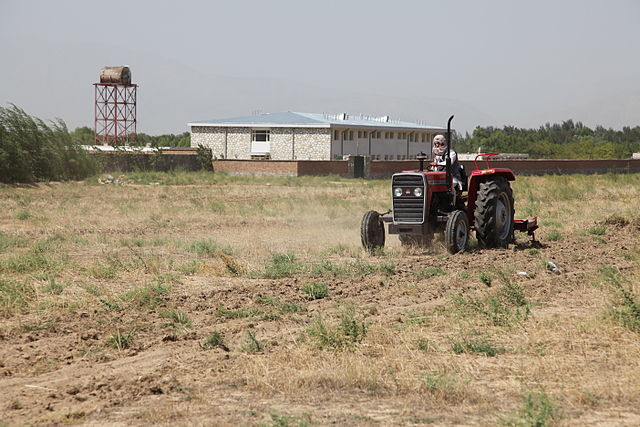

## Heartbeat 

### Motivation 

This pattern can help project participants stay in touch, and stay motivated.

### Context 

A number of people have a shared interest, and have connected with each
other about it. However, they are not going to spend 24 hours a day, 7
days a week working together, either because they are busy with other
things, or because working separately on some tasks is vastly more
efficient.

### Forces 

>  **Differentiation**: the time we spend together isn’t all equally meaningful.  
>  **Entropy**: something needs to hold the project together, or it will fall apart.

### Problem 

How will the effort be sustained and coordinated sufficiently? How do we
know this an active collaboration, and not just a bunch of people
milling about? Is there a *there, there?*

### Solution 

People seem to naturally gravitate to something with a pulse. *Once a
day* (stand-ups), *once a week* (meetings), or *once a year*
(conferences, festivals) are common variants. When the project is
populated by more than just a few people, it’s likely that there will be
several Heartbeats, building a sophisticated
polyrhythm. A well-running project will feel “like an improvisational
jazz ensemble” \[1\]. Much as the band
director may gesture to specific players to invite them to solo or sync
up, a project facilitator may craft individual emails to ask someone to
lead an activity or invite them to re-engage. Two common rhythm
components are weekly synchronous meetings with an open agenda, combined
with *ad hoc* meetings for focused work on A specific
project. The precise details will depend on the degree of
integration required by the group.

### Rationale 

The project’s heartbeat is what sustains it. Just as *people matter more
than code* \[2\], so does the life of the
working group matter more than mechanics of the work structure. Indeed,
there is an quick way to do a reality check and find the project’s
strongest pulse: the activities that sustain a healthy project should
sustain us, too (cf. Carrying capacity).

### Resolution 

Noticing when a new Heartbeat is beginning to
emerge is a way to be aware of the shifting priorities in the group, and
contributes to further **differentiation**. This may ultimately be a
good source of new patterns. On the other hand, if a specific activity
is no longer sustaining the project, stop doing it, much as you would
move an out-of-date pattern to the Scrapbook
in order to make room for other concerns. The power of the
Heartbeat is that the project can be as
focused and intensive as it needs to be, working against **entropy** in
the ways that start to be required as time goes by.

### Example 1 

The yearly in-person gathering, Wikimania, is the most visible example
of a Heartbeat for the Wikimedia
movement.[^fn1]
may run additional in-person get-togethers.[^fn2]
Also of note is the twice-yearly call for proposals for
individual engagement grants.[^fn3]
other shorter cycles. Each day a highly-vetted Featured Article appears
on the front page of Wikipedia, and is circulated to a special-purpose
mailing list.[^fn4],[^fn5],[^fn6] articles for deletion lasts at least seven days.[^fn7]

  
*University Farm: al-Biruni University, Kapisa province, Afghanistan.*

### Example 2 

Although it may sound quaint, some variant of the University Farm could
help to physically sustain peeragogues, while putting the project’s
Heartbeat in tune with that of the seasons.
In the current distributed mode, we tend our window
boxes and allotment gardens. New developments should unfold in a
*logical order growing out of the needs of the community* \[3\].

### What’s Next in the Peeragogy Project

> Actual meeting times to be added

Identifying and fostering new Heartbeats and
new working groups can help make the community more robust. This is the
time dimension of spin-off projects described in Reduce,
reuse, recycle.

### References

1. David M. Dikel, David Kane, and James R. Wilson. 2001. *Software architecture: Organizational principles and patterns*. Pearson Education.

2. Linus Torvalds and Steven Vaughan-Nichols. 2011. Linus Torvalds’s Lessons on Software Development Management. *Input Output*. Retrieved from <http://web.archive.org/web/20131021211847/http://h30565.www3.hp.com/t5/Feature-Articles/Linus-Torvalds-s-Lessons-on-Software-Development-Management/ba-p/440>

3. Booker T Washington. 1901. *Up from slavery*. Doubleday & Company, Inc.

------------------------------------------------------------------------

[^fn1]: <https://meta.wikimedia.org/wiki/Wikimania>

[^fn2]: <http://wikiconferenceusa.org/>

[^fn3]: <https://meta.wikimedia.org/wiki/Grants:IEG>

[^fn4]: <https://en.wikipedia.org/wiki/Wikipedia:Today%27s_featured_article>

[^fn5]: <https://en.wikipedia.org/wiki/Wikipedia:Featured_article_candidates>

[^fn6]: <https://lists.wikimedia.org/mailman/listinfo/daily-article-l>

[^fn7]: <https://en.wikipedia.org/wiki/Wikipedia:Articles_for_deletion>
