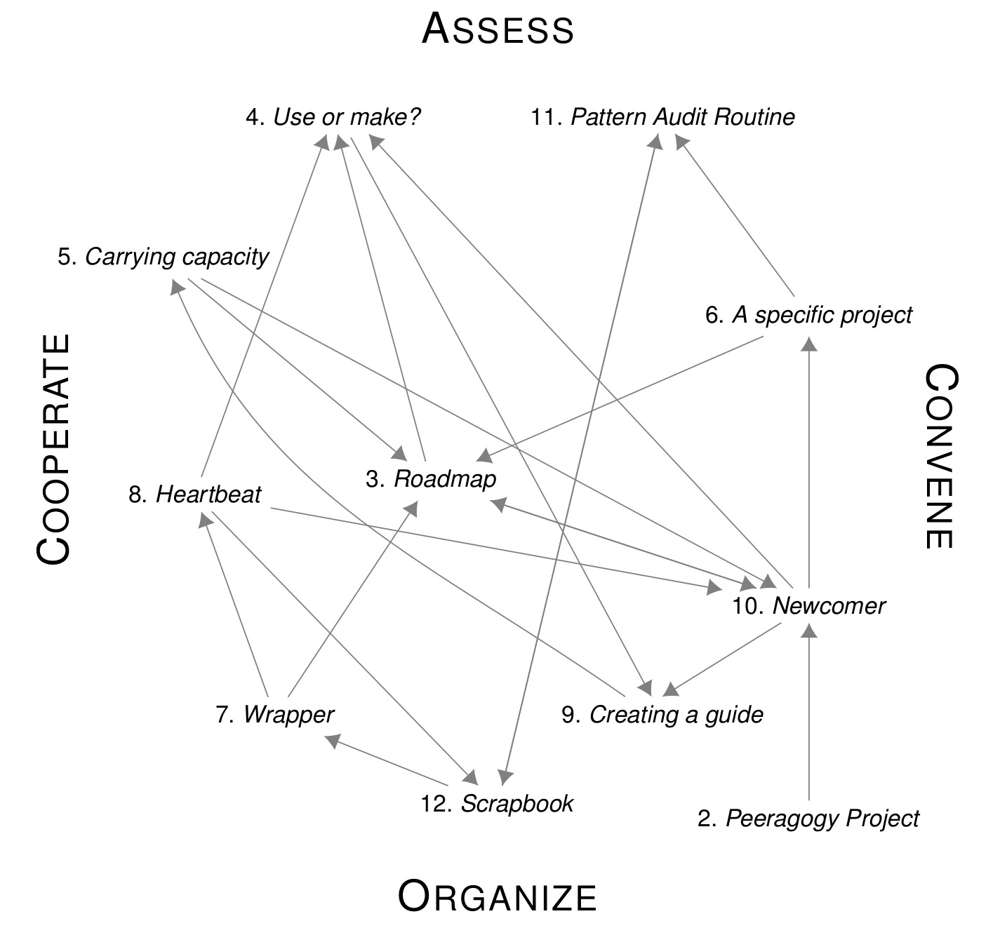
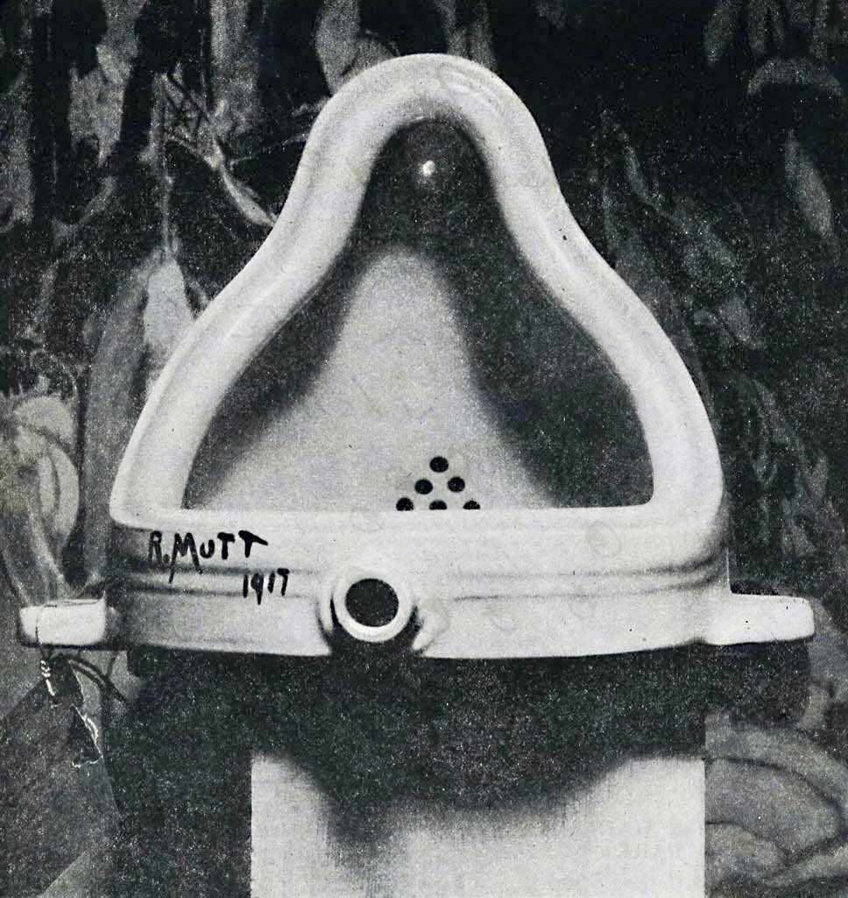
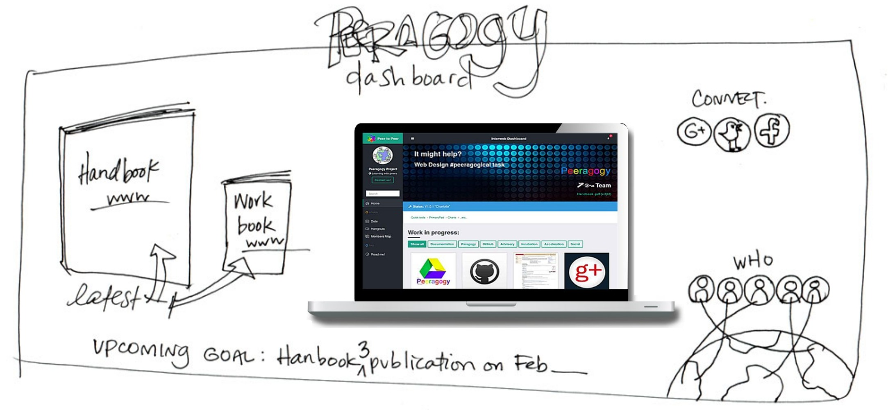

Readers will have encountered *peer production*, at least in
applications like Wikipedia, StackExchange, and free/libre/open source
software development. Readers will also be familiar with *peeragogy*,
even if the name is unfamiliar. Simply put, peeragogy is active learning
together with others. Participants in a peeragogical endeavor
collaboratively build emergent structures that are responsive to their
changing context. They learn – and they adapt. Taking inspiration from
the notable successes of peer production, we are using peeragogy to help
design the future of learning, inside and outside of institutions.

We have found design patterns useful for organizing our work on this
momentous task. However, there is a difference between the pattern
language we present here and previous collections of design patterns
that touch on similar domains – like *Liberating Voices: A Pattern
Language for Communication Revolution* [11] and
*Pedagogical Patterns: Advice for Educators* [3]. At
the level of the pattern template, our innovation is simply to add a
“What’s next” annotation to each pattern, which anticipates the way the
pattern will continue to “resolve” in our work.

This mirrors the central considerations of our approach, which is all
about human interaction, and the challenges, fluidity and lack of
predictability that comes with it. Something that works for one person
may not work for another or may not even work for the same person in a
slightly different situation. Nevertheless, it is hard to argue with a
formula like “If W applies, do X to get Y.” In our view, other pattern
languages often achieve this sort of common sense rationality, and then
stop. Failure in the prescriptive model only begins when people try to
define things more carefully and make context-specific changes – when
they actually try to put ideas into practice. The problem lies in the
inevitable distance between *do as I say*, *do as I do*, and *do with
me* [7, p. 26].

Figure 6.1. A prototypical university. Caption reads: “Wisconsin State University,
Madison, Wis. 1879”. Inset captions describe the pictured buildings:
“Ladies Hall, South Dormitory, University Hall, Assembly Halls &
Library, North Dormitory, Science Hall, President’s Residence,
University Farm, and Washburn Observatory.” Public domain.

This paper outlines a new approach to the organization of learning,
drawing on the principles of free/libre/open source software (FLOSS) and
open culture. Mako Hill suggests that one recipe for success in peer
production is to take a familiar idea – his example is an encyclopedia –
and make it easy for people to participate in building it 
[9, Chapter 1]. Another inspiring familiar idea is the university. We will
take hold of “learning in institutions” as a map (Figure 6.1),
though it does not fully conform to the tacitly-familiar territory of
peeragogy. To be clear, peeragogy is not just for teachers and students,
but for *any group of people who want to learn anything*.

Indeed, the strong version of our claim is that peeragogy is needed in
applications of any map, blueprint, or design that seeks to involve
people as people. In some idealized sense, “control” is all that’s
required to move from a well-thought-out design to successful execution.
But, at the very least, this leaves the question: where do the designs
come from in the first place [12]? Once they exist,
designs need to be interpreted, and often, revised. People may think
that they are on the same page, only to find out that their
understandings are wildly different. For example, everyone may agree
that the group needs to go “that way.” But how far? How fast? It is rare
for a project to be able to set or even define all parameters accurately
and concisely at the beginning.

This is true for pattern languages as well. We describe them in text,
but they become a “living language” [1, p. xvii] just
insofar as they are linked to action. Many things have changed since
Alexander suggested that “you will get the most ‘power’ over the
language, and make it your own most effectively, if you write the
changes in, at the appropriate places in the book” 
[1, p. xl]. We see more clearly that we can build living designs, and
inscribe their changing form not just in the margins of a book, or even
a shared wiki, but in the lifeworld itself.

Although we are often thinking about learning and adaptation that takes
place far outside of formal institutions, the historical conception of
the university can offer some guidance. The model university is not
separate from the life of the state or its citizenry, but aims to
“assume leadership in the application of knowledge for the direct
improvement of the life of the people in every sphere”
[6, p. 88]. Research that *adds to the store of
knowledge* is another fundamental obligation [6, p. 550]. Our emergent approach to collaboration and knowledge-building
is likely to be of interest to theorists in fields like organization
studies and, perhaps surprisingly, computer science, where researchers
are increasingly making use of social approaches to software design and
development (e.g., via the [Manifesto for Agile Software
Development](http://www.agilemanifesto.org/)) as well as agent-based
models of computation and learning 
[10, 5]. The design pattern community in particular is very
familiar with practices that we think of as peeragogical, notably
shepherding and writers workshops [8, 4]. We hope to help design pattern authors and researchers expand on these strengths.

The next section introduces **Peeragogy** more explicitly in the form of a
design pattern. The following sections present the other patterns in
our pattern language. Figure 6.2 illustrates their
interconnections. In each pattern description, the key forces that
apply within the pattern’s context are highlighted in bold face. Each
pattern also includes two examples. The first example shows how the
pattern is exhibited in current Wikimedia projects. We have selected
Wikimedia as a source of examples because we are relatively familiar
with it, and because the relevant data is readily available to
readers.  The second example shows how the given pattern could be
applied in the design of a future university. Whereas existing
projects like Wikimedia’s Wikiversity and the Peer-2-Peer University
(P2PU) have created “a model for lifelong learning alongside
traditional formal higher education,” they stop well short of offering
accredited degrees. What would an accredited free/libre/open
university offering general education look like? How would it compare
or contrast with the typical or stereotypical image of a university
from Figure 6.1?

Each pattern concludes with a “What’s next” annotation, and Chapter
[7](http://peeragogy.github.io/distributed_roadmap.html) collects these next steps and summarizes the
outlook of the Peeragogy project. It also sums up what’s unique about
this catalog, positioning it work as a hands-on complement to existing
sociological and historical research about peer production (surveyed in [2]).

Figure 6.2.  Connections between the patterns of peeragogy. An arrow points from pattern **A** to pattern **B** if the description of pattern **A** references pattern **B**. Labels at the borders of the figure correspond to the main sections of the *Peeragogy Handbook*.

#### References

1. Christopher Alexander, Sara Ishikawa, and Murray Silverstein. A Pattern Language: Towns, Buildings, Construction. Center for Environmental Structure Series. Oxford: Oxford University Press, 1977.
2. Yochai Benkler, Aaron Shaw, and Benjamin Mako Hill. “Peer production: a modality of collective intelligence”. In: The Collective Intelligence Handbook. Ed. by Thomas W. Malone and Michael S. Bernstein. To appear. MIT Press, 2015.
3. Joseph Bergin et al. Pedagogical patterns: Advice for educators. New York: Joseph Bergin Software Tools, 2012.
4. James O Coplien and B Woolf. “A pattern language for writ ers’ workshops”. In: C++ report 9 (1997), pp. 51–60.
5. J. Corneli et al. “Computational Poetry Workshop: Making Sense of Work in Progress”. In: Proceedings of the Sixth Inter national Conference on Computational Creativity, ICCC 2015. Ed. by Simon Colton et al. 2015. url: [http://metameso.org/~joe/docs/poetryICCC-wip.pdf](http://metameso.org/~joe/docs/poetryICCC-wip.pdf).
6. Merle Eugene Curti et al. The University of Wisconsin, a history: 1848-1925. Univ. of Wisconsin Press, 1949.
7. Gilles Deleuze. Difference and repetition. London: Bloomsbury Academic, 2004.
8. Neil B Harrison. “The Language of Shepherding”. In: Pattern Languages of Program Design 5 (1999), pp. 507–530.
9. Benjamin Mako Hill. “Essays on Volunteer Mobilization in Peer Production”. PhD thesis. Massachusetts Institute of Technology, 2013. url: [http://dspace.mit.edu/handle/1721.1/86240](http://dspace.mit.edu/handle/1721.1/86240).
10. Marvin Minsky. “Why programming is a good medium for expressing poorly understood and sloppily formulated ideas”. In: Design and Planning II-Computers in Design and Communication. Visual Committee Books. 1967, pp. 120–125.
11. Douglas Schuler. Liberating voices: A pattern language for communication revolution. Cambridge, MA: MIT Press, 2008.
12. Heinz Von Foerster. “Cybernetics of cybernetics”. In: Understanding Understanding. Springer, 2003 [1979], pp. 283–286.

# Peeragogy

#### Context

Architectual maverick Christopher Alexander [1] asked
the following questions to an audience of computer programmers:

> “What is the Chartres of programming? What task is at a high enough
> level to inspire people writing programs, to reach for the stars?”

In order for humanity to pull itself up by its bootstraps, on this
planet or any other, we need to continue to learn and adapt.
Collaborative projects like Wikipedia, StackExchange, and FLOSS
represent an implicit challenge to the old “industrial” organization of
work. This new way of working appears to promise something more
resilient, more exciting, and more humane. In the context of these free,
open, post-modern organizations, individual participants are learning
and growing – and adapting the methods and infrastructure as they go.
Because everyone in these projects primarily learns by putting in effort
on a shared work-in-progress, participants are more in touch with an
*equality of intelligence* than an *inequality of knowledge*
[4, [pp. 38,119]. At the same time, they invoke a form
of friendly competition, in which *the best craftmanship wins*
[5, p. 89]. **There is a tension between the
inclusiveness of an “open” work and the specificity required in order to
develop something really useful. The trust that is required to sustain a
culture of learning is only built through sharing and reciprocity.**

#### Problem

Even a highly successful project like Wikipedia is a work in progress
that can be improved to **better* empower and engage people around the
world, to develop *richer and more useful* educational content, and to
disseminate it *more* effectively* – and deploy it more creatively.
How to go about this is a difficult question, and we don’t know the
answers in advance. There are rigorous challenges facing smaller
projects as well, and fewer resources to draw on. Many successful free
software projects are not particularly collaborative – and the largest
projects are edited only by a small minority of users
[3, 8]. Can we work smarter together?

#### Solution

People who learn actively together talk to each other about material
problems, share practical solutions, and constructively critique
works-in-progress. There are many different ways to go about this – bug
reports, mailing lists, writers workshops, Q&A forums, watercoolers and
skateparks are all places where peeragogy can happen. We have found that
the necessary “reflection” aspects of the process are particularly
well-matched to Christopher Alexander’s idea of a *pattern language*, in
which commonly occurring, interconnected, elements of an optative design
are refined until they can be described in terms of a simple template.
Indeed, thought of as a design pattern, **Peeragogy** can be understood as an
up-to-date revision of Alexander’s **Network of Learning** [1, p. 99]. It
*decentralizes the process of learning and enriches it through contact
with many places and people* – in interconnected networks that may reach
all over the world. Importantly, while people involved in a peeragogical
process may be collaborating on **A specific project**, they don’t have to be direct
collaborators outside of the learning context or co-located in time or
space. Peeragogy often takes place in mostly-horizontal relationships
between people who have different but compatible objectives.

#### Rationale

The peeragogical approach particularly addresses the problems of small
projects stuck in their individual silos, and large projects becoming
overwhelmed by their own complexity. It does this by going the opposite
route: explicating *what by definition is tacit* and employing *a
continuous design process* [6, pp. 9–10]. The very act
of asking “can we work smarter together?” puts learning front and
center. **Peeragogy** takes that “center” and distributes it across a pool of
heterogeneous relationships. As pedagogy articulates the transmission of
knowledge from teachers to students, peeragogy articulates the way peers
produce and use knowledge together (Figure 6.2). Active
learning together with others brings social and emotional intelligence
to bear on the things that matter most.

#### Resolution

Peeragogy helps people in different projects describe and solve real
problems. If you share the problems that you’re experiencing in your
project, someone may be able to help you solve them. This process can
guide individual action in ways that we wouldn’t have seen on our own,
and may lead to new forms of collective action we would never have
imagined possible. Making room for multiple right answers resolves the
tension between generality and specificity. The Peeragogy project is one
of “tens of thousands of projects in the traditions of world improvement
élan – without any central committee that would have to, or even could,
tell the active what their next operations should be”
[7, p. 402]. When we talk about “next steps,” we aim
to clarify our own commitments, and show what can be realistically
expected from us.

#### Example 1

Wikipedia and its sister sites rely on user generated content, peer
produced software, and are managed, by and large, by a pool of users who
choose to get involved with governance and other “meta” duties.
Wikimedia’s pluralistic approach achieves something quite impressive:
the Wikimedia Foundation runs the 7th most popular website in the
world, and has around 230 employees. For comparison, the 6th and 8th
most popular websites are run by companies with 150K and 30K employees,
respectively.

#### Example 2

Although one of the strengths of **Peeragogy** is to distribute the workload, this
does not mean that infrastructure is irrelevant. No less than their
predecessors, the students and researchers of the future university will
need access to an Observatory and other scientific apparatus if they are
truly to reach *ad astra, per aspera*.

*What’s next.* We intend to revise and extend the patterns and methods
of peeragogy to make it a workable model for learning, inside or outside
of institutions.

#### References

1. Christopher Alexander. “The origins of pattern theory: The
   future of the theory, and the generation of a living world”.
   In: Software, IEEE 16.5 (1999), pp. 71–82.
2. Christopher Alexander, Sara Ishikawa, and Murray Silverstein. A Pattern Language: Towns, Buildings, Construction.
   Center for Environmental Structure Series. Oxford: Oxford
   University Press, 1977.
3. Benjamin Mako Hill. When Free Software Isn’t (Practically) Better. Published on gnu.org. Licensed via CC-By-
   SA. 2011. url: http://www.gnu.org/philosophy/when_free_software_isnt_practically_better.html.
4. Jacques Rancière. The ignorant schoolmaster: Five lessons in
    intellectual emancipation. Stanford University Press, 1991
    [1987].
5. Eric S Raymond. The Cathedral & the Bazaar: Musings
   on Linux and open source by an accidental revolutionary.
   O’Reilly Media, Inc., 2001.
6. Till Schümmer, Joerg M Haake, and Wolfgang Stark. “Beyond
   rational design patterns”. In: Proceedings of the 19th European
   Conference on Pattern Languages of Programs. ACM. 2014, 13
   pp.
7. P. Sloterdijk. You Must Change Your Life. Polity Press, 2013.
8. Aaron Swartz. Who Writes Wikipedia? Published on
    aaronsw.com. 2006. url: http://www.aaronsw.com/weblog/whowriteswikipedia.

# Roadmap

#### Context

**Peeragogy** has both distributed and centralized aspects. The different discussants
or contributors who collaborate on a project have different points of
view and heterogeneous priorities, but they come together in
conversations and joint activities. **Different people will have
different goals and interests in mind; some may be quite specific, and
some rather vague. Upon further scrutiny, some of these goals will be
seen to be well-aligned, others less so.**

#### Problem

In order to collaborate, people need a way to share current, though
incomplete, understanding of the space they are working in, and to
nurture relationships with one another and the other elements of this
space. Without a sense of our individual goals or how they fit together
in the context of addressing outstanding problems, it is difficult for
people to help out, or to assess the project’s progress. At the outset,
there may not even be a project or a vision for a project, but a only
loose collection of motivations and sentiments. Once the project is
running, people are likely to pull in different directions.

#### Solution

Building a guide to current and upcoming activities, experiments, goals
and working methods can help **Newcomers** and old-timers alike see where they can
jump in. This guide may take various forms, and different levels of
detail. It may be a research question or an outline, an organizational
mission statement or a business plan. It may be a design pattern or a
pattern language [3]. It may combine features of a
manifesto, a syllabus, and an issue tracker. The distinguishing
qualities of a project **Roadmap** are that it should be adaptive to circumstances
and that it should ultimately get us from *here* to *there*. By this
same token, any given version of the roadmap is seen as fallible. It
should be accessible to everyone with an interest in the project, though
in practice not everyone will choose to update it. In lieu of widespread
participation, the project’s **Wrapper** should attempt to synthesize an accurate
roadmap informed by participants’ behavior, and should help moderate in
case of conflict. However, full consensus is not necessary. Different
goals, with different *heres* and *theres*, can be pursued separately,
while maintaining communication. To the extent that it’s possible,
combining everyone’s individual plan into an overall **Roadmap** can help give
everyone a sense of what’s going on.

#### Rationale

Unless the project’s plan is easy for people to see and to update, they
are not likely to use it, and are less likely to get involved. The key
point of the roadmap is to help support involvement by those who *are*
involved. The level of detail in the roadmap (and the existence of a
roadmap at all) should correspond to the felt need for sharing
information and to the tolerance of uncertainty among participants. The
structure of the roadmap should be able shift along with its contents:
it is an antidote to **Tunnel Vision** [1, pp. 121–124]. In the Peeragogy
project our roadmap evolved from an outline of the first draft of the
*Peeragogy Handbook*, to a schedule of meetings with a regular “**Heartbeat**”
supplemented by a list of upcoming submission deadlines, to the emergent
objectives listed in Section [sec:Distributed~R~oadmap] of the current
paper. By contrast, we’ve seen that a list of nice-to-have features is
comparatively unlikely to *go* anywhere. A backlog of tasks and a
realistic plan for accomplishing them can be vastly different things. An
adaptive roadmap that incorporates multiple simultaneous solution paths
can achieve integration around core values without over-determining or
over-constraining participation.

#### Resolution

Using the pattern catalog as an organizational tool gives us a robust
mechanism for building and maintaining a “distributed”, and ultimately
“emergent” roadmap – whose components are rooted in real problems and
justifiable solutions, with a concrete resolution and followthrough.
When these components are put together, we get a reasonably coherent and
actionable idea of where the project is going. The roadmap can give **Newcomers** a
reasonable idea of what it would mean to participate in the project, and
can help them decide whether, where, and how to get involved.

#### Example 1

The *Help* link present on every Wikipedia page could be seen as a
localized **Roadmap** for individual user engagement. It tells users what they
can do on the site:

> I want to read or find an article; I want to edit an article; I want
> to report a problem with an article; I want to create a new article or
> upload media; I have a factual question… [Etc.]

Community-organized WikiProjects and official Wikimedia projects
announce their objectives and invite others to get involved (cf. **A specific project**).
Wikimedia previously developed a detailed strategic plan drawing on
community input [2]. The current description of the State
of the Wikimedia Foundation includes a pointer to a two-week 2015
Strategy Community Consultation (now closed for purposes of review and
synthesis).

#### Example 2

In the future university, maintaining a special President’s Residence
would presumably be an undue opulence. However it may be appropriate for
project facilitators to gather at a University Hall for the primary
purpose of working together on the university’s **Roadmap**. For now, we mostly
meet online, and in person less frequently: at cafes, when passing
through town, or at conferences. In New York alone, there are a million
members of meetup.com with similar habits, although they most likely
have never heard of peeragogy. There is strength in numbers – and
there is leverage in organization. Whatever we balance we strike between
“global” and “local” operations, the purpose of our roadmap is to help
us get organized.

*What’s Next.* If we sense that something needs to change about the
project, that is a clue that we might need to record a new pattern, or
revise our existing patterns.

#### References

1. David M. Dikel, David Kane, and James R. Wilson. Software
   architecture: Organizational Principles and Patterns. Pearson
   Education, 2001.
2. Eugene Eric Kim et al. Wikimedia Strategic Plan: A collaborative vision for the movement through 2015. Wikimedia Foundation, 2011.
3. Christian Kohls. “The structure of patterns”. In: Proceedings of
    the 17th Conference on Pattern Languages of Programs. ACM.
    2010, p. 12.

# Reduce, reuse, recycle

#### Context

In a peer production context, you are simultaneously “making stuff” and
building on the work of others. **You don’t have to do everything
yourself! The library of resources you can draw on is vast – but it is
useful only if you can make sense of it.**

#### Problem

People are often very attached to their own projects and priorities and
don’t have a sense of how their initiatives can benefit from connection
and relationship. Many projects die because the cost of **Reinventing the Wheel** [c2](http://c2.com/cgi/wiki?ReinventingTheWheel) is too
high.

#### Solution

“Steal like an artist,” and make it possible for other people to build
on your work too (Figure [fountain]). In the Peeragogy project, we have
written very little new software, and have instead used off-the-shelf
and hosted solutions suited to the task at hand (including: Drupal,
Google+, Google Hangouts, Google Docs, Wordpress, pandoc, XeLaTeX,
Authorea, and Github). Early on we agreed to release our *Peeragogy
Handbook* under the terms of the Creative Commons Public Domain
Dedication (CC0), the legal instrument that grants the greatest possible
leeway to downstream users. This has allowed us and others to
repurpose and improve its contents in other settings, including the
current paper. In short, follow the steps indicated by the keywords in
the pattern’s title: *Reduce* the panoply of interesting interrelated
ideas and methods to a functional core (e.g. writing a book). *Reuse*
whatever resources are relevant to this aim, factoring in “things I was
going to have to do anyway” from everyone involved. *Recycle* what
you’ve created in new connections and relationships.

Figure 6.3. A paradigmatic example of found-art. Caption reads: “Fountain by R.
Mutt, Photograph by Alfred Stieglitz, THE EXHIBIT REFUSED BY THE
INDEPENDENTS”. Public domain, via the Wikimedia Commons.

#### Rationale

Clearly we are not the first people to notice the problems with
wheel-reinvention, including “missing opportunities, repeating common
mistakes, and working harder than we need to.” As a guest in one of
our hangouts, Willow Brugh, of Geeks without Bounds and the MIT Media
Lab, remarked that *people often think that they need to build a
community, and so fail to recognize that they are already part of a
community.*

#### Resolution

Peeragogy per se is not new, and it’s not something we can bottle and
sell. It appears in avocational, academic, and industrial contexts. We
can, however, learn how to be more capable peeragogues with practice.
Reweaving old material into new designs and new material into existing
frameworks, we build deeper understanding. The project’s **Roadmap** develops by
making sense of existing resources – including worries and concerns.
This boosts our collective **Carrying capacity**.

#### Example 1

Users are encouraged to recycle existing works that are compatible with
the Wikimedia-wide CC-By-SA license, and the mission of the respective
sites (e.g. books on Wikibooks or Wikisource, dictionary entries on
Wiktionary, encyclopedic writing on Wikipedia, etc.). Subprojects have
existed purely to help repurpose other existing works in this way.
On the downstream side, DBPedia is an important resource for the
semantic web, built by collating data from Wikipedia’s “infoboxes”.
Researchers have been able to **Reduce, reuse, recycle** in other ways, e.g. by developing tools
for building learning paths through Wikipedia content, or that show
heatmaps of editing activity. However, these research projects do not
always result in a tool that is accessible to day-to-day users.

#### Example 2

The knowledge resources and collaboration tools currently available
online are what make a low-cost, high-quality, formally-accredited
future university conceivable. However, the available resources are not
always as organized as they would need to be for educative purposes, so
peeragogues can usefully put effort into **Reduce, reuse, recycle**’ing available resources into a
functioning university Library.

*What’s Next.* We’ve converted our old pattern catalog from the
*Peeragogy Handbook* into this paper, sharing it with a new community
and gaining new perspectives. Can we repeat that for other things we’ve
made?

# Carrying Capacity

#### Context

One of the important maxims from the world of FLOSS is: “Given enough
eyeballs, all bugs are shallow” [6, p. 30]. A partial
converse is also true. **There’s only so much any one person can do with
limited resources and a limited amount of time. Furthermore, in a
peeragogy context, it is often impossible to delegate work to others.
Lines of responsibility are not always clear, and people can easily get
burnt out. Our concern is not simply “inclusion” but rather to help
everyone involved fulfil their potential. This will not happen for
someone who takes on too much, or someone who takes on too little.**

#### Problem

How can we help prevent those people who are involved with the project
from overpromising or overcommitting, and subsequently crashing and
burning? First, let’s be clear that are lots of ways things can go
wrong. Simplistic expectations – like *assuming that others will do the
work for you* [9] – can undermine your ability to
correctly gauge your own strengths, weaknesses, and commitments. Without
careful, critical engagement, you might not even notice when there’s a
problem. Where one person has trouble letting go, others may have
trouble speaking up. Pressure builds when communication isn’t going
well.

#### Solution

Symptoms of burnout are a sign that it’s time to revisit the group’s **Roadmap** and
your own individual plan. Are these realistic? Frustration with other
people is a good time to ask questions and let others answer. Do they
see things the same way you do? Your goals may be aligned, even if your
methods and motivations differ. If you have a “buddy” they can provide a
reality check. Maybe things are not *that hard* after all – and maybe
they don’t need to be done *right now*. Generalizing from this: the
project can promote an open dialog by creating opportunities for people
to share their worries and generate an emergent plan for addressing them
[8]. Use the project **Scrapbook** to make note of obstacles. For
example, if you’d like to pass a baton, you’ll need someone there who
can take it. Maybe you can’t find that person right away, but you can
bring up the concern and get it onto the project’s **Roadmap**. The situation is
always changing, but if we continue to create suitable checkpoints and
benchmarks, then we can take steps to take care of an issue that’s
getting bogged down.

#### Rationale

Think of the project as an ecosystem populated by acts of participation.
As we get to know more about ourselves and each other, we know what
sorts of things we can expect, and we are able to work together more
sustainably [4]. We can regulate our individual stress
levels and improve collective outcomes by discussing concerns openly.

#### Resolution

Guiding and rebalancing behaviour in a social context may begin by
simply speaking up about a concern. What we learn in this process is
consistent with inclusivity [1], but goes further, as
participants are invited to be candid about what works well for them and
what does not. As we share concerns and are met with care and practical
support, our actions begin to align better with expectations (often as a
result of forming more realistic expectations). When we have the
opportunity to express and rethink our concerns, we can become more
clear about the commitments we’re prepared to make. As we become aware
of the problems others are facing, we often find places where we
ourselves have something to learn.

#### Example 1

Wikipedia aims to emphasize a neutral point of view, but its users are
not neutral. Wikipedia is relevant to things that matter to us. It
helps inform us regarding our necessary purposes – and we are invited to
“speak up” by making edits on pages that matter to us. However, coverage
and participation are not neutral in another sense. More information on
Wikipedia deals with Europe than all of the locations outside of Europe
[3]. A recent solicitation for donations to the Wikimedia
Foundation says “Wikipedia has over 450 million readers. Less than 1%
give.” As we remarked in the **Peeragogy** pattern, most of the actual work is
contibuted by a small percentage of users as well. Furthermore, the
technology limits what can be said; [3] remark on “the
structural inability of the platform itself to incorporate fundamental
epistemological diversity.” Finally, the overall population of editors
is an important concern for the Wikimedia Foundation: the total number
of active editors has been falling since 2007.

#### Example 2

A separate Ladies Hall seems entirely archaic. Progressive thinkers have
for some time subscribed to the view that “there shall be no women in
case there be not men, nor men in case there be not women”
[5, Chapter 1.LII]. However, in light of the extreme
gender imbalance in free software, and still striking imbalance at
Wikipedia [2,7], it will be important to do whatever it
takes to make women and girls welcome, not least because this is a
significant factor in boosting our **Carrying capacity**.

*What’s Next.* Making it easy and fruitful for others to get involved is
one of the best ways to redistribute the load. This often requires skill
development among those involved; compare the **Newcomer** pattern.

#### References

1. D Randy Garrison and Zehra Akyol. “Toward the development of a metacognition construct for communities of
   inquiry”. In: The Internet and Higher Education 17 (2013),
   pp. 84–89.
2. Rishab A. Ghosh et al. Free/Libre and Open Source Software:
   Survey and Study. Tech. rep. D18. International Institute of
   Infonomics, University of Maastricht, 2002.
3. Mark Graham et al. “Uneven geographies of user-generated
   information: patterns of increasing informational poverty”.
   In: Annals of the Association of American Geographers 104.4
   (2014), pp. 746–764.
4. Elinor Ostrom. “Revising theory in light of experimental
   findings”. In: Journal of Economic Behavior & Organization
   73.1 (2010), pp. 68–72.
5. François Rabelais. Gargantua and Pantagruel. Moray Press,
   1894.
6. Eric S Raymond. The Cathedral & the Bazaar: Musings
   on Linux and open source by an accidental revolutionary.
   O’Reilly Media, Inc., 2001.
7. Joseph Reagle. ““Free as in sexist?” Free culture and
    the gender gap”. In: First Monday 18.1 (2012). issn:
    13960466. url: http://firstmonday.org/ojs/index.php/fm/article/view/4291.
8. Jaakko Seikkula and Tom Erik Arnkil. Dialogical meetings in
    social networks. Karnac Books, 2006.
9. Linus Torvalds and Steven Vaughan-Nichols. Linus
    Torvalds’s Lessons on Software Development Management. 2011. url: http://web.archive.org/web/20131021211847/http://h30565.www3.hp.com/t5/Feature-Articles/Linus-Torvalds-s-Lessons-on-Software-Development-Management/ba-p/440.

# A specific project

#### Context

We often find ourselves confronted with what seems to be a difficult,
complex, or even insurmountable problem. It won’t go away, but a
workable solution doesn’t present itself, either. If there is a
candidate solution, it’s also clear there are not enough resources for
it to be feasible. **In the face of serious difficulties we often find
ourselves wringing our hands, or preaching to the choir about things
they already know. It is harder to make actionable plans and follow them
through to bring about concrete change.**

#### Problem

We are often blinded by our own prejudices and preferences. Considerable
energy goes into pondering, discussing, exploring and feeling stuck.
Meanwhile there may be a strong urge to make more concrete progress, and
time is passing by. In a group setting, when the forward-movers
ultimately try to act, those who are more wrapped up in the experience
of pondering and exploring may attempt to shut them down, if they feel
that they are being left behind. Inaction may seem like the only safe
choice, but it has risks too.

#### Solution

One of the best ways to start to make concrete progress on a hard
problem is to ask a specific question. Formulating a question helps your
thinking become more concrete. Sometimes you’ll see that a solution was
within your grasp all along, and you don’t actually need to ask the
question to anyone anymore. In the case of a truly difficult problem,
one question won’t be enough, but you can repeat the process: turning
something that is too large or too ephemeral to tackle directly into a
collection of smaller, specific, manageable tasks that you can learn
something from. Maintain an overall project **Roadmap** to keep track of how the
smaller pieces relate to the bigger picture. If you have a fairly
specific idea about what you want to do, but you’re finding it difficult
to get it done, don’t just ask for advice: recruit material help (cf. **Carrying capacity**).

#### Rationale

We’ve seen time and again that asking specific questions is a recipe for
getting concrete, and that getting concrete is necessary for bringing
about change. Asking for help (which is what happens when you vocalize a
question) is one of the best ways to gain coherence. Making yourself
understood can go a long way toward resolving deeper difficulties.

#### Resolution

Where you may have felt stuck or realized you were going in circles,
getting specific allows forward progress. The struggle between consensus
and action is resolved in a tangible project that combines action with
dialog. Learning something new is a strong sign that things are working.
Real change starts out “bite-sized.”

#### Example 1

One of the best ways to jump in, get to know other Wikipedia users, and
start working on a focused todo list is to join (or start) **A specific project**. Within
Wikipedia, these are known as “WikiProjects.” The Wikimedia
Foundation also runs public projects, including the Wikipedia Education
Program and the GLAM Wiki (for Galleries, Libraries, Archives, and
Museums). The latter maintains a *list of case studies that
describes specific projects undertaken by cultural organizations and
Wikimedia*.

#### Example 2

Dormitories could be seen as an “optional extra,” since studying from
where you live is often an option already. However, rented or
cooperatively-owned living/working spaces may frequently be an asset for **A specific project**.

*What’s Next.* We need to build specific, tangible “what’s next” steps
and connect them with concrete action. Use the **Scrapbook** to organize that process.

# Wrapper

#### Context

You are part of an active, long-running, and possibly quite complex
project with more than a handful of participants. How do you manage?
**The project presents a certain user interface to the world. If the
primary interface is based on a simple leader/follower dichotomy, then
it’s easy to know where everyone stands. But peeragogy requires a more
sophisticated facilitation/colearning dynamic.**

#### Problem

In an active project, it can be effectively impossible to stay up to
date with all of the details. Not everyone will be able to attend every
meeting (see **Heartbeat**) or read every email. Project participants can easily get
lost and drift away. The experience can be much more difficult for **Newcomers**:
joining an existing project can feel like trying to climb aboard a
rapidly moving vehicle. If you’ve taken time off, you may feel like
things have moved on so far that you cannot catch up. Information
overload is not the only concern: there is also a problem with missing
information. If they aren’t shared, key skills can quickly become
bottlenecks (see **Carrying capacity**).

#### Solution

Someone involved with the project should regularly create a wrap-up
summary, distinct from other project communications, that makes current
activities comprehensible to people who may not have been following all
of the details. In addition, project members should keep other
informative resources like the landing page, **Roadmap**, and documentation up to
date. Ensure that these resources accurately represent the facts on the
ground, and check empirically to see if they really show interested
parties how they can get involved.

#### Rationale

According to the theory proposed by Yochai Benkler, for free/open
“commons-based” projects to work, it is important for participants to be
able to contribute small pieces, and for the project to have a way to
stitch those pieces together [1]. The **Wrapper** helps perform this
integrative stitching function. If you value participation, you may have
to do some serious work to facilitate access to process.

#### Resolution

Regularly circulated summaries can help to engage or re-engage members
of a project, and can give an emotional boost to peeragogues who see
their contributions and concerns mentioned. Well-maintained records
chronicle the project’s history; up-to-date documentation makes the
project more robust; a coherent look-and-feel makes it accessible. In
short, surfaces matter. People can tell the difference between a project
that is led by example and one that is led by fiat; they can see right
away if the project welcomes contributions with love, and if the
participants feel they have something valuable to share.

#### Example 1

There are many data streams around the Wikimedia project. They comprise
an elaborate **Wrapper** function for the project, with components that range from
Today’s Featured Article, which appears on the front page of Wikipedia,
to formal annual reports from the nonprofit. Wikipedia also
plays a function in a broader sense. It is a typical first port of call
for people searching for information about the world.

#### Example 2

In-person meetings are no less relevant for contemporary humans than
they were a century ago, even though we often work remotely, and have
learned more about how to assemble on the fly [2].
Getting together for conventions, dance parties, and commencement
ceremonies could comprise an important part of the future university’s **Wrapper**
function, even if these events do not always take place in one specific
Assembly Hall.

*What’s Next.* We have prototyped and deployed a visual “dashboard” that
people can use to get involved with the ongoing work in the project.
Let’s improve it, and match it with an improved interaction design for
peeragogy.org.

Figure 6.4. Design for a Peeragogy project dashboard (design sketch by Amanda
Lyons, prototype by Fabrizio Terzi).

#### References

1. Y. Benkler. “Coase’s Penguin, or Linux and the Nature of the Firm”. In: Yale Law Journal 112 (2002), p. 369.
2. Howard Rheingold. Smart mobs: The next social revolution. Basic books, 2007.
	
# Heartbeat

#### Context

A number of people have a shared interest, and have connected with each
other about it. However, they are not going to spend 24 hours a day, 7
days a week working together, either because they are busy with other
things, or because working separately on some tasks is vastly more
efficient. **Even if we do spend lots of time together, it isn’t all
equally meaningful. Something needs to hold the project together, or it
will fall apart.**

#### Problem

How will the effort be sustained and coordinated sufficiently? How do we
know this an active collaboration, and not just a bunch of people
milling about? Is there a *there, there?*

#### Solution

People seem to naturally gravitate to something with a pulse. *Once a
day* (standups), *once a week* (meetings), or *once a year*
(conferences, festivals) are common variants. When the project is
populated by more than just a few people, it’s likely that there will be
several **Heartbeats**, building a sophisticated polyrhythm. A well-running project
will feel “like an improvisational jazz ensemble” [1].
Much as the band director may gesture to specific players to invite them
to solo or sync up, a project facilitator may craft individual emails to
ask someone to lead an activity or invite them to re-engage. Two common
rhythm components are weekly synchronous meetings with an open agenda,
combined with *ad hoc* meetings for focused work on **A specific project**. The precise
details will depend on the degree of integration required by the group.

#### Rationale

The project’s heartbeat is what sustains it. Just as *people matter more
than code* [2], so does the life of the working group
matter more than mechanics of the work structure. Indeed, there is an
quick way to do a reality check and find the project’s strongest pulse:
the activities that sustain a healthy project should sustain us, too
(cf. **Carrying capacity**).

#### Resolution

Used mindfully, the **Heartbeat** can be a sophisticated tool. Noticing when a new **Heartbeat** is
beginning to emerge is a way to be aware of the shifting priorities in
the group, and may be a good source of new patterns. Like a **Heartbeat**, patterns
recur. On the other hand, if a specific activity is no longer sustaining
the project, stop doing it, much as you would move an out-of-date
pattern to the **Scrapbook** in order to make room for other concerns. The power of
the **Heartbeat** is that the project can be as focused and intensive as it needs to
be.

#### Example 1

The yearly in-person gathering, Wikimania, is the most visible example
of a **Heartbeat** for the Wikimedia movement. Local chapters and projects may
run additional in-person get-togethers. Also of note is the
twice-yearly call for proposals for individual engagement grants.

#### Example 2

Although it may sound quaint, working farms could help to physically
sustain peeragogues, while putting the project’s **Heartbeat** in tune with that of
the seasons. In the current distributed mode, we tend our windowboxes
and allotment gardens.

*What’s Next.* Identifying and fostering new and new working groups is a
task that can help make the community more robust. This is the time
dimension of spin off projects described in **Reduce, reuse, recycle**.

#### References

1. David M. Dikel, David Kane, and James R. Wilson. Software
    architecture: Organizational Principles and Patterns. Pearson
    Education, 2001.
2. Linus Torvalds and Steven Vaughan-Nichols. Linus
    Torvalds’s Lessons on Software Development Management. 2011. url: <http://web.archive.org/web/20131021211847/http://h30565.www3.hp.com/t5/Feature-Articles/Linus-Torvalds-s-Lessons-on-Software-Development-Management/ba-p/440>.
	
# Newcomer

#### Context

When there’s learning happening, it’s because there is someone who is
new to a topic, or to something about the topic. **There is an
‘invisible hand’ in peeragogy that makes it so that each person pursuing
his or her own optimal course of learning is what’s best for the
community. However, this does not isolate us from one another, but draws
us together.**

#### Problem

Newcomers can feel overwhelmed by the amount of things to learn. They
don’t know where to start. They may have a bunch of ideas that the
oldtimers have never considered – or they may think they have new ideas,
which are actually a different take on an old idea; see . People who are
new to the project can tell you what makes their participation
difficult. Since you’re learning as you go as well, you can ask yourself
the same question: what aspects of this are difficult for me?

#### Solution

In an active learning context, we render assistance to others more
effectively when we do so as peers, rather than doing it as experts
operating in a *provisionist* mode [1]. Instead of thinking of
newcomers as “them”, and trying to provide solutions, we focus on
newcomers as “us” – which makes the search for solutions that much more
urgent. We permit ourselves to ask naive questions. We entertain vague
ideas. We add concreteness by trying **A specific project**. We may then genuinely turn to
others for help.

#### Rationale

Sharing vulnerability and confusion gives us a chance to learn together.
A newcomer’s confusion about how best to get involved or what the point
of all this actually is may be due to a lack of structure in the project **Roadmap**
, and it points to places where others in the project probably have
something to learn too.

#### Resolution

An awareness of the difficulties that newcomers face can help us be more
compassionate to ourselves and others. We become open to new ideas,
which can show how we have been limiting ourselves. Relative to the
goals of effecting real change and enhancing the world’s liveability, we
really are beginners. We will have a better chance of making the project
useful for others if we’re clear about how it is useful to *us*.

#### Example 1

Wikipedia **Newcomers** can make use of resources that include a “Teahouse” where
questions are welcomed, a platform extension that changes the user
interface for new editors, and lots of
documentation. The efforts of exceptional newcomers
may be given special recognition. Newcomer “survival” is of
interest to the Wikimedia Foundation. The degree to which Wikimedia
projects emphasize continuous upskilling (à la the **Newcomer** pattern) is somewhat
less clear.

#### Example 2

It will often be pragmatic to connect with employment, so that the
future university may see a closer coupling of science and industry than
is held in the former model. Inspiration can be drawn the London-based
freelancing cooperative Founders&Coders, which is able to offer
intensive training in web development at no cost to successful
applicants, on the basis that some trainees will choose to join the
cooperative as paying members later on.

*What’s Next.* A more detailed (but non-limiting) “How to Get Involved”
walk-through or “DIY Toolkit” would be good to develop. We can start by
listing some of the things we’re currently learning about.

# Reference

1. D. Boud and A. Lee. “‘Peer learning’ as pedagogic discourse
for research education”. In: Studies in Higher Education 30.5
(2005), pp. 501–516.
	
# Scrapbook

#### Context

We’ve maintained and revised our pattern catalog over a period of years.
We’re achieving the “What’s Next” steps attached to some of the
patterns. **We have limited energy, and therefor need to ask: where
should we set the focus?**

#### Problem

Not all of the patterns we’ve noticed remain equally relevant. In
particular, some of the patterns no longer lead to concrete next steps.

#### Solution

In order to maintain focus, is important to “tune” and “prune” the
collection of patterns receiving active attention. Connect this
understanding to concrete actions undertaken in the project by
frequently asking questions like these:

> \(1) Review what was supposed to happen. (2) Establish what is
> happening/happened. (3) Determine what’s right and wrong with what we
> are doing/have done. (4) What did we learn or change? (5) What else
> should we change going forward? [Chapter 28](./realtime.html).

After reviewing our activities with respect to these questions, our
current priorities will become clearer. If a particular pattern is no
longer of current relevance, move it to a **Scrapbook**. In addition to retired
patterns, use the scrapbook to maintain a backlog, or “parking lot,” of
proto-patterns, in the form of outstanding problems, issues, and
concerns. Don’t limit yourself to *your own* creativity: include
bookmarks to or clippings from patterns from other sources (see **Reduce, reuse, recycle**).

#### Rationale

We want our pattern catalog to be concretely useful and actively used,
and to keep attention focused on the most relevant issues. If a pattern
is not specifically useful or actionable at the moment, sufficient time
for reflection may offer a better understanding, or it may prove useful
in a different context.

#### Resolution

Judicious use of the **Scrapbook** can help focus project participants, and can make
it easier to communicate current priorities to others in a clear manner.
The currently active pattern catalog is leaner and more action-oriented
as a result. A realistic and useful focus takes both the past and the
future into account. If the **Roadmap** shows where we’re going, it is the **Scrapbook** that
shows most clearly where we’ve been.

#### Example 1

Now that new plans are being formed, the Wikimedia Foundation’s previous
“five year plan” somewhat resembles a **Scrapbook** [1].

#### Example 2

In the future university, the patterns described here will continue to
shape the landscape, but considerable activity will be focused on new
problems and new patterns – just as a university campus grows and
changes with the addition of new buildings.

*What’s Next.* After pruning back our pattern catalog, we want it to
grow again: new patterns are needed. One strategy would be to
“patternize” the rest of the *Peeragogy Handbook.*

#### References

References
1. Eugene Eric Kim et al. Wikimedia Strategic Plan: A collaborative vision for the movement through 2015. Wikimedia Foundation, 2011.

